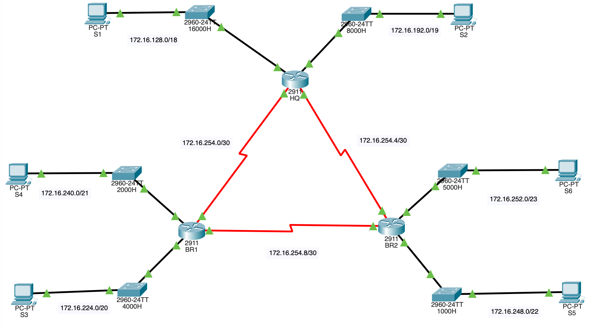
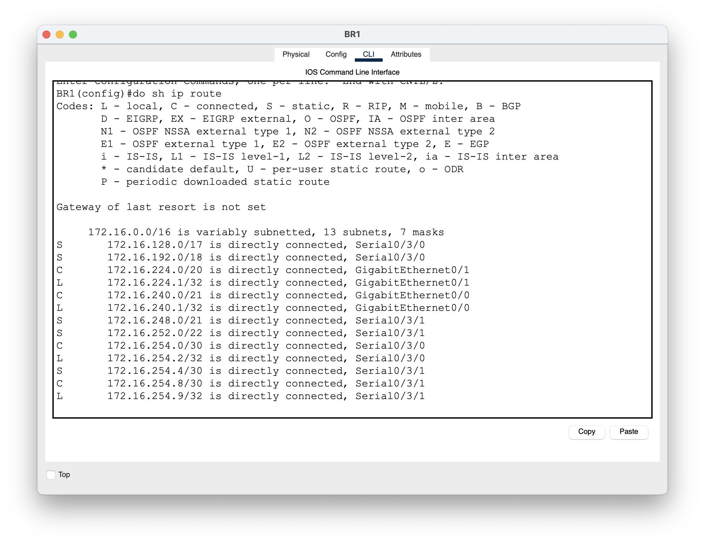

# VLSM Calculations & Routing Table

This document outlines the subnetting using Variable Length Subnet Masking (VLSM) and the corresponding routing information.

---

## Network Topology

---

## VLSM Subnet Table

| LAN | Subnet Mask     | Network Address | Usable Range                  | Broadcast Address |
|-----|-----------------|-----------------|--------------------------------|------------------|
| 1   | 255.255.128.0   | 172.16.128.0    | 172.16.128.1 - 172.16.191.254 | 172.16.191.255   |
| 2   | 255.255.192.0   | 172.16.192.0    | 172.16.192.1 - 172.16.223.254 | 172.16.223.255   |
| 3   | 255.255.224.0   | 172.16.224.0    | 172.16.224.1 - 172.16.239.254 | 172.16.239.255   |
| 4   | 255.255.240.0   | 172.16.240.0    | 172.16.240.1 - 172.16.247.254 | 172.16.247.255   |
| 5   | 255.255.248.0   | 172.16.248.0    | 172.16.248.1 - 172.16.251.254 | 172.16.251.255   |
| 6   | 255.255.252.0   | 172.16.252.0    | 172.16.252.1 - 172.16.253.254 | 172.16.253.255   |
| 7   | 255.255.255.252 | 172.16.254.0    | 172.16.254.1 - 172.16.254.2   | 172.16.254.3     |
| 8   | 255.255.255.252 | 172.16.254.4    | 172.16.254.5 - 172.16.254.6   | 172.16.254.7     |
| 9   | 255.255.255.252 | 172.16.254.8    | 172.16.254.9 - 172.16.254.10  | 172.16.254.11    |

---

## Routing Table

| Router                | Known Networks                                   | Unknown Networks                                   |
|---------------------------|--------------------------------------------------|---------------------------------------------------|
| HQ | 172.16.128.0; 172.16.192.0; 172.16.254.0; 172.16.254.4         | 172.16.224.0; 172.16.240.0; 172.16.248.0; 172.16.252.0; 172.16.254.8 |
| BR1             | 172.16.224.0; 172.16.240.0; 172.16.254.0; 172.16.254.8         | 172.16.128.0; 172.16.192.0; 172.16.248.0; 172.16.252.0; 172.16.254.4 |
| BR2             | 172.16.248.0; 172.16.252.0; 172.16.254.4; 172.16.254.8         | 172.16.128.0; 172.16.192.0; 172.16.224.0; 172.16.240.0; 172.16.254.0 |

### HQ Routing table

### BR1 Routing table

### BR2 Routing table

---

## Notes
- **VLSM** allows efficient use of IP address space.  
- **Routing Table** separates known and unknown networks for each router, helping identify where static or dynamic routes must be added.  
- `/30` subnets are typically used for point-to-point links.  

